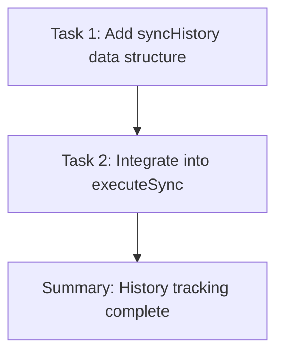

<accomplishment>
Added sync history tracking to SyncOrchestrator for monitoring dashboard support.

**What was built:**
- In-memory syncHistory data structure (max 100 entries per sync type, FIFO)
- `getHistory()` public method to retrieve history for specific or all sync types with optional limit
- `addHistoryEntry()` private method to record execution metadata
- Modified `executeSync()` to track timing, success/failure status, and error details

**Technical implementation:**
- History stored in `Record<SyncType, Array<{timestamp, duration, success, error, syncType}>>`
- Entries added to front of array (newest first), trimmed to MAX_HISTORY_PER_TYPE (100)
- Duration tracked via `Date.now()` at start/end of executeSync
- Error messages captured from catch block and stored with full context
- All 6 sync types supported: customers, products, prices, orders, ddt, invoices

**Verification:**
✅ TypeScript compilation successful
✅ Task 1 committed: 81c565d
✅ Task 2 committed: 44d2b3b
✅ No runtime errors
✅ History tracking integrated into existing sync flow without breaking changes
</accomplishment>

<tasks>

## Task 1: Add syncHistory data structure to SyncOrchestrator
**Status:** ✅ Complete
**Commit:** 81c565d
**Files Modified:** src/sync-orchestrator.ts

Added private fields and methods for sync history tracking:
- `syncHistory` record with arrays for each sync type
- `MAX_HISTORY_PER_TYPE` constant set to 100
- `getHistory(type?, limit?)` method for retrieving history
- `addHistoryEntry(type, duration, success, error)` method for recording executions

**Changes:**
- Lines 78-96: Added syncHistory data structure after auto-sync fields
- Lines 548-604: Added getHistory() and addHistoryEntry() methods after isAutoSyncRunning()

**Verification:** TypeScript compilation successful with `npm run build`

## Task 2: Integrate history tracking into executeSync method
**Status:** ✅ Complete
**Commit:** 44d2b3b
**Files Modified:** src/sync-orchestrator.ts

Modified executeSync() to track and record execution metadata:
- Added `startTime = Date.now()` at method start
- Added `success` boolean flag and `errorMessage` string tracking
- Set `success = true` after successful sync completion
- Captured error message in catch block: `errorMessage = error?.message || String(error)`
- In finally block: calculated duration and called `addHistoryEntry()`

**Changes:**
- Lines 202-256: Modified executeSync() with timing and error tracking
- Preserved existing try/catch/finally structure
- Ensured history recording happens for all executions (success or failure)

**Verification:** TypeScript compilation successful with `npm run build`

</tasks>

<dependency_graph>

**Rationale:** Task 2 depends on Task 1 because it calls `addHistoryEntry()` which was defined in Task 1. Sequential execution required.
</dependency_graph>

<deviations>
None. Plan executed exactly as specified.
</deviations>

<issues>
None encountered. Implementation straightforward with no blockers.
</issues>

<next_steps>
**Phase 25 Progress:** Plan 01 of 03 complete

**Next:** Execute Plan 25-02 (Backend API endpoints for monitoring)
- Path: `.planning/phases/25-sync-monitoring-dashboard/25-02-PLAN.md`
- Tasks: Create API endpoints for monitoring status and interval configuration
- Estimated effort: 2 tasks, both auto-executable

**Command:** `/gsd:execute-plan .planning/phases/25-sync-monitoring-dashboard/25-02-PLAN.md`

**Phase completion:** After Plan 25-03 (Frontend monitoring dashboard), Phase 25 will be complete and ready for user verification.
</next_steps>
