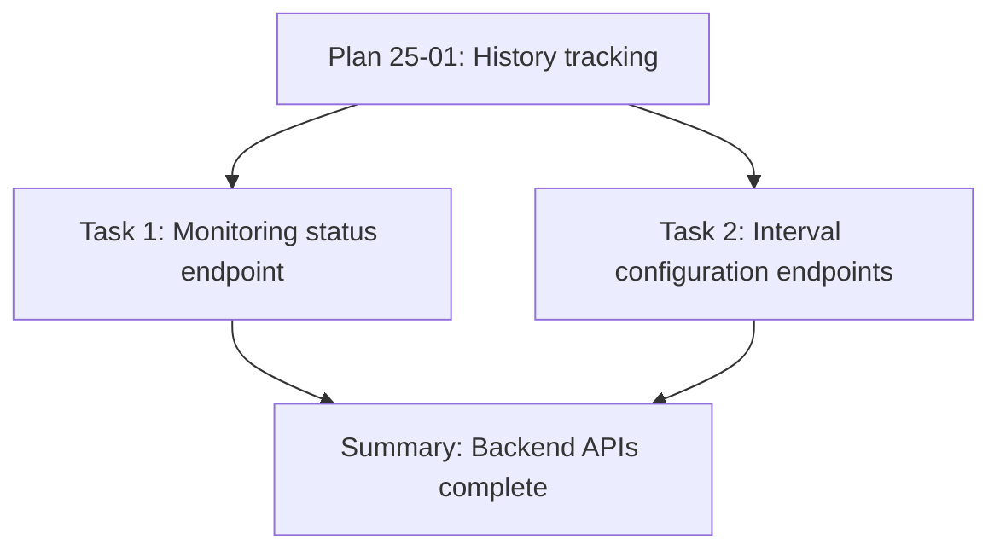

<accomplishment>
Created backend API endpoints for sync monitoring and interval configuration with dynamic orchestrator restart.

**What was built:**
- GET /api/sync/monitoring/status endpoint returning comprehensive monitoring data for all 6 sync types
- GET /api/sync/intervals endpoint returning current intervals (default + custom overrides)
- POST /api/sync/intervals/:type endpoint for updating intervals with validation (5-1440 minutes)
- SyncOrchestrator methods: getIntervals(), updateInterval() with dynamic auto-sync restart

**Technical implementation:**
- Monitoring status endpoint combines orchestrator.getStatus() with history per sync type
- Health indicators (healthy/unhealthy/idle) based on most recent execution success/failure
- Custom intervals stored in orchestrator, merged with defaults when queried
- Dynamic interval updates: stopAutoSync() → update customIntervals → startStaggeredAutoSync()
- All endpoints protected with JWT + requireAdmin middleware
- Comprehensive validation: sync type validation, interval range (5-1440), type checking
- Detailed logging of interval changes with user ID tracking

**Verification:**
✅ TypeScript compilation successful
✅ Task 1 committed: 17c1b26
✅ Task 2 committed: a4e53ca
✅ All endpoints admin-only with JWT + requireAdmin
✅ Validation enforces 5-1440 minute range
✅ Dynamic restart mechanism implemented
</accomplishment>

<tasks>

## Task 1: Create GET /api/sync/monitoring/status endpoint
**Status:** ✅ Complete
**Commit:** 17c1b26
**Files Modified:** src/index.ts

Added comprehensive monitoring endpoint that returns:
- Current sync status from orchestrator.getStatus()
- Sync history for each of 6 types (orders, customers, products, prices, ddt, invoices)
- Health indicators: "healthy" (last run succeeded), "unhealthy" (last run failed), "idle" (no history)
- Configurable history limit via query parameter (default: 20 entries)
- JWT + requireAdmin middleware protection

**Data structure returned:**
```json
{
  "success": true,
  "currentSync": "orders" | null,
  "types": {
    "orders": {
      "isRunning": boolean,
      "lastRunTime": string | null,
      "queuePosition": number | null,
      "history": [{ timestamp, duration, success, error }],
      "health": "healthy" | "unhealthy" | "idle"
    },
    // ... for each sync type
  }
}
```

**Verification:** TypeScript compilation passed

## Task 2: Create interval configuration endpoints
**Status:** ✅ Complete
**Commit:** a4e53ca
**Files Modified:** src/sync-orchestrator.ts, src/index.ts

**Part A: SyncOrchestrator methods**
- Added `customIntervals` private field for storing interval overrides
- Implemented `getIntervals()` returning merged defaults + custom intervals
- Implemented `updateInterval(type, minutes)` with validation and dynamic restart
- Modified `startStaggeredAutoSync()` to use `getIntervals()` for dynamic intervals
- Default intervals: orders=10min, customers=30min, products=90min, prices=30min, ddt=45min, invoices=30min

**Part B: API endpoints**
- GET /api/sync/intervals - returns current intervals for all 6 types
- POST /api/sync/intervals/:type - updates interval for specific type with body { intervalMinutes: number }
- Validation: sync type must be valid, interval must be number between 5-1440
- Error responses: 400 for validation errors, 500 for orchestrator errors
- Success response includes confirmation message, type, and new interval

**Dynamic restart flow:**
1. Validate interval (5-1440 minutes)
2. Stop current auto-sync (clear timers/intervals)
3. Update customIntervals[type] = new value
4. Restart auto-sync with getIntervals() pulling new values
5. Log restart completion

**Verification:** TypeScript compilation passed

</tasks>

<dependency_graph>


**Rationale:** Both tasks independent but both depend on Plan 25-01's history tracking methods. Task 1 uses getHistory(), Task 2 adds new methods to orchestrator.
</dependency_graph>

<deviations>
None. Plan executed exactly as specified.
</deviations>

<issues>
None encountered. Implementation straightforward with no blockers.
</issues>

<next_steps>
**Phase 25 Progress:** Plan 02 of 03 complete

**Next:** Execute Plan 25-03 (Frontend monitoring dashboard component)
- Path: `.planning/phases/25-sync-monitoring-dashboard/25-03-PLAN.md`
- Tasks: Create SyncMonitoringDashboard component with 6 cards, history tables, error modal, interval configuration
- Estimated effort: 3 tasks (component + modal + integration), checkpoint for user verification

**Command:** `/gsd:execute-plan .planning/phases/25-sync-monitoring-dashboard/25-03-PLAN.md`

**Phase completion:** After Plan 25-03, Phase 25 will be complete with full monitoring dashboard (backend + frontend).
</next_steps>
